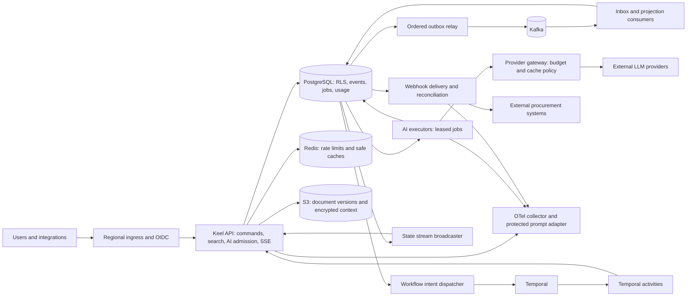
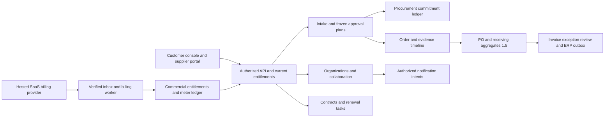

# Architecture

## 1. Placement and boundaries

Keel is a modular backend with independent runtime roles built from one source artifact. Synchronous request handlers perform short transactions and admission decisions. Durable workflows, model generation, event projections and external delivery run outside those transactions. Separating runtime roles allows distinct identity, autoscaling and failure budgets without inventing a service per domain entity.

Workers may call shared domain command libraries with a scoped database transaction instead of an internal HTTP hop. The diagram shows logical ownership, not a requirement for every arrow to cross the network. Command authorization remains enforced for both entry points.

## 2. Runtime roles

| Role | Responsibilities | Scale/identity |
|---|---|---|
| `api` | OIDC/RBAC, order commands, search, inference admission, SSE transport | Baseline three AZ-spread replicas; app API DB role; no owner/DDL privileges |
| `relay` | Publish next events and workflow intents with retry/fencing | Two replicas for failover; leases distribute stream heads; scoped queue metadata privileges |
| `projector` | Kafka inbox, projections, webhook fanout and durable job intake | Consumer-group replica ceiling aligned to partitions; tenant-scoped mutation |
| `ai-executor` | Fair leased-job claims, retrieval/extraction/model work and persisted output | Scales on runnable DB backlog and age; interruptible for resumable work |
| `temporal-worker` | Deterministic onboarding workflows and idempotent activities | Minimum two replicas; activity task-queue concurrency capped |
| `webhook-worker` | Endpoint-safe delivery, attempt recording, reconciliation and replay | Leased delivery claims; per-tenant/endpoint concurrency caps |
| `billing-worker` | Subscription inbox/reconciliation, entitlement and invoice/meter observations | Own SaaS processor identity; bounded queue/provider calls; never procurement payment authority |
| `notification-worker` | Resource-authorized in-app/email/chat intent delivery | Separate mail/chat secrets and quotas; no business approval rights |
| `procurement-worker` (1.5) | Sourcing/PO/receipt/invoice/contract scheduled jobs and qualified ERP handoff | Scoped domain/connector roles; financial transitions remain transactional commands |

State broadcasting is part of API instances: short polling of durable `state_updates` plus Redis notification hints wakes local subscribers. Notifications can be lost; the database sequence cursor is authoritative. API replicas do not hold a complete tenant history in RAM.

## 3. Order command path

Authenticate and derive trusted tenant identity. Acquire admission capacity, begin a tenant-scoped transaction, authorize against current roles/policy, claim an idempotency key, lock the aggregate head, validate expected version/state, append events and update the reconstructable command snapshot, append outbox/state-update rows and store the command response. Commit before returning success. No Kafka, model or webhook call occurs within the transaction.

Each accepted command inserts immutable event/outbox content and a pending `outbox_delivery` row in its transaction. `outbox_publish_heads.next_version` permits one event at a time per aggregate. A relay claim uses `FOR UPDATE SKIP LOCKED`, database-clock expiry and a monotonically increasing lease epoch. The worker validates the allowlisted envelope, publishes synchronously to Kafka outside the transaction, and only after broker acknowledgement marks delivery published and advances the head in one fenced transaction. Broker errors persist a coarse error class and bounded exponential retry with deterministic jitter. A permanently invalid envelope moves to durable `blocked` state, releases its lease and leaves the head in place for operator investigation; later versions cannot pass it. Kafka uses `RequireAll`, one client attempt and tenant/aggregate partition keys; retries belong to PostgreSQL. A lost acknowledgement or worker crash can duplicate an accepted Kafka record, so delivery is at least once and event IDs stay stable across attempts. The K1.5 projector validates the metadata-only envelope against retained canonical outbox history, writes its inbox identity and status-only projection in one tenant transaction, serializes by aggregate head, and repairs gaps from that history. This projection is pinned to one consumer identity until generation-scoped rebuilds exist. Its forced-RLS projector role cannot mutate canonical events. It stores only digests and bounded reasons for malformed/conflicting records; unproven tenant claims use tenantless transport quarantine and raw broker payloads are never persisted. K1.7 adds a Kafka group adapter with automatic commits disabled and synchronous manual offset commits after durable projection/quarantine. Relay acknowledgement-loss, consumer DB-commit/offset-commit loss and group restart/rebalance are fault-tested. Shadow-generation rebuild/cutover remains staged separately.

Kafka client transport is explicit: only `NewLocalSyntheticBroker` and `NewLocalSyntheticConsumer` permit plaintext on loopback or the local Compose alias. All other constructors require verified TLS 1.2+ against an explicitly configured CA pool and SCRAM-SHA-512; there is no remote plaintext fallback. The producer writer and consumer reader can replace their connection generation under a serialized credential/trust rotation. The current deployment profile remains `local-synthetic`; cloud runtime secret injection and any managed Kafka service are still unqualified.

## 4. Search path

Query normalization removes control characters and enforces term/size bounds. The typed retrieval API starts a read-only tenant-scoped transaction. BM25 lexical candidates and pgvector semantic candidates use the same document visibility predicate: tenant, effective ACL/classification, publication status and eligible version. Fetch a bounded candidate pool, combine ranks with RRF, optionally rerank a limited set, and return cited immutable version IDs.

BM25 statistics are tenant-local; global document frequency can leak information and distort small tenants. The initial implementation stores inverted postings and corpus/term statistics in PostgreSQL. This prioritizes isolation and exact scoring over extension dependency. Its capacity envelope is capped and benchmarked. A pg_search/other extension is an optional later adapter, never substituted before qualification of RLS, effective corpus filtering and score behavior.

ANN filtering can underfill results or lose recall. Small/selective tenant corpora use exact search; larger corpora use HNSW with bounded iterative scans and explicit fallback. Qualify actual plans and recall. Do not assume a tenant predicate makes a global ANN index equally efficient for every tenant distribution.

K3.1 pins `keel.unicode-words.v1` (NFKC + Unicode full case folding + letter/number tokenization with raw UTF-8 byte offsets) and `keel.paragraph-window.v1` (bounded token windows, overlap and optional heading context) as immutable analyzer/chunker identities. The model manifest binds model ID/revision, provider, artifact digest, tokenizer, dimensions, input bound, vector normalization and distance; corpus-build identity includes those contracts and the source-version set. Unknown mutable aliases are rejected. The checked-in CC0 seed is entirely synthetic and evaluation-only. Its linter verifies labels, source spans, scope negatives, no-answer cases, digests and cross-split leakage. It does not qualify a hosted model, quality, capacity or production serving. Any analyzer/chunker/model change creates a parallel corpus/index identity; versions are never mixed in one scoring space.

K3.2 adds a tenant-and-visibility-cohort-local PostgreSQL lexical index. An isolated indexer role stages opaque HMAC term IDs and citation metadata into an unpublished build, derives document frequency statistics, and finalizes only after database constraints reconcile all expected chunks, token lengths, postings and statistics. Publication takes a locked cohort head, checks its expected generation, switches the pointer, marks the new immutable build published and retires the old one in a single transaction. `keel_app` can only read; it cannot stage, publish or mutate lexical rows. RLS binds every read and write to both the transaction tenant and exact visibility cohort. HMAC IDs bind tenant and key-version identity; source text and raw tokens never enter these tables. Search reads a repeatable-read snapshot and has explicit term, posting-row and top-k budgets; overflow returns an error without a partial ranking. This is a PostgreSQL reference BM25 index, not yet an HTTP search feature, hybrid/vector retrieval, production performance qualification, retention/deletion workflow or a claim of relevance quality.

K3.3 introduces an immutable model manifest and vectors tied to a specific published K3.2 corpus generation. A model revision cannot change tokenizer/analyzer identity, artifact digest, dimension, normalization, distance metric or input bound; a changed model is a parallel identity. Exact cosine search uses original single-precision vectors and a bounded candidate set. Optional HNSW is provisioned as a partial index for one model revision and dimension, stores a halfvec expression, applies tenant/cohort/corpus filters and RLS, uses strict iterative scans with explicit limits, and reranks retrieved candidates against the original vectors. If HNSW underfills, exact fallback runs only under the configured whole-build budget; otherwise the result is marked degraded and stays underfilled. The pinned pgvector supports 4,000-dimension halfvec HNSW and 16,000-dimension exact vectors. CI uses an explicit synthetic 3D fixture only; no embedding provider or customer search path is enabled or qualified.

## 5. Model path

Inference admission reserves a bounded worst-case spend in PostgreSQL before queueing. The request references a versioned prompt, provider policy, context/document versions and validated tools. Executors retrieve and redact context, check exact/semantic cache eligibility, and invoke a provider within concurrency/time/budget limits. Streaming chunks are transient; accepted complete responses and final usage are persisted. Provider fallback occurs only before any user-visible content, with a separately charged attempt under the same inference ID.

Sensitive prompts are not blindly sent to the trace backend. A protected context vault can retain encrypted prompt/input/context versions under tenant policy. OTel/Langfuse observations reference that record and store safe metadata. Authorized replay uses a sandbox and suppresses business writes/webhooks.

## 6. Durable approvals

The API commits an onboarding case and a stable workflow-start intent. The dispatcher retries Temporal start using a deterministic workflow ID. Approval commands lock the authoritative case, evaluate current reviewer assignment or one active delegation, and append an immutable decision plus a minimal workflow intent in one transaction. Temporal consumes decision IDs and reloads durable records in an activity; signal delivery is at least once. The expiry command uses the same case lock, so the database acceptance timestamp, not signal arrival order, decides a race. Automatic timer/activity mounting remains a K0/K0.1 runtime gate.

Workflow code contains no direct DB/network calls. Activities are idempotent and identify their logical operation. Workflow version changes preserve already-running cases. Case expiry and approval race handling is specified in SPEC.md.

## 7. Hosted topology and regional model

Production default: one AWS home region, private EKS nodes in three AZs, managed PostgreSQL with synchronous in-region standby, managed Kafka, managed Redis-compatible service, managed/self-hosted qualified Temporal, private S3 access and KMS. Public traffic reaches an ingress/WAF, never the database. Model/webhook outbound traffic uses an egress proxy with hostname/IP policy and bounded connection pools.

Tenants have a home-region field. Edge ingress can run in another region but forwards writes and quota admission to the home region. No multi-region database or Redis conflict resolution is implied. Cross-region disaster recovery uses a promoted recovery region and explicit single-writer fencing; asynchronous replication means nonzero RPO.

Each workload receives distinct Kubernetes/cloud/DB roles. Durable infrastructure is outside the application's scale-to-zero lifecycle. Ghostlight previews run in a separate account and follow the shared dependency contract.

## 8. Optimization strategy

- Keep transactions small: bounded command payloads, no external I/O under row locks, timeouts on locks/statements.
- Use connection pools with a global database connection budget; adding API replicas must not exhaust PostgreSQL.
- Protect model/extraction concurrency with per-tenant fair claims and global worker limits. A single hot tenant must not occupy all provider slots.
- Batch event publication and projection while preserving per-stream correctness; avoid one consumer group per tenant.
- Persist document chunks and versioned embeddings once; maintain lexical/vector projections asynchronously.
- Partition large append-only ledgers by time only after measuring volume; always preserve deduplication semantics across partitions.
- Use bounded SSE fanout, replay cursors and periodic snapshots. Do not retain arbitrary token history in API RAM.
- Scale targeted worker roles before extracting domain services. Split search storage only when its workload envelope exceeds the qualified PostgreSQL adapter.

## 9. Alternatives and consequences

A generic autonomous-agent platform would introduce many unsupported tool effects; Keel keeps one procurement domain and explicit commands. Kafka alone is not an event store with tenant authorization and immutable historical query; PostgreSQL owns that source. Temporal replaces home-grown multi-day timers but adds versioning/operational requirements. Redis accelerates soft admission and cache hints but does not replace durable spend accounting. The first deployment spends on always-on durable services; it does not promise cheap production simply because worker pods can scale to zero.

## 10. SaaS and purchasing module boundaries

Add bounded modules in the existing Go artifact: `organizations/identity`, `commercial`, `notifications/collaboration`, `intake/policies`, `suppliers/portal`, `procurement-budgets`, and in 1.5 `sourcing/catalog`, `purchase-orders/receiving`, `invoice-review`, `contracts/renewals`. Enterprise adds business scopes/risk and policy simulation. Each owns typed commands/tables; cross-module invariants execute within one PostgreSQL transaction through domain libraries. No network hop is needed to convert an approval reservation to commitment.

Money/authority boundaries remain explicit: procurement ledger represents customer spending authority; AI ledger represents provider liability; commercial ledger represents Keel subscription charges. They share transaction infrastructure but not balances or role grants. Customer portal uses supplier-scoped access independent of internal membership. Enterprise business-unit/document scope is enforced below tenant RLS, including search/context/cache eligibility digests.

Billing/notification/provider effects use durable intents/inbox/outbox, scoped identities and reconciliation. Previews simulate those providers. The shared contract 1.1 adds reviewed roles without arbitrary candidate privileges. New runtime roles stay inside admitted DB/CPU/memory/provider budgets; initial technical capacity is requalified with actual SaaS and purchasing workloads. See PRODUCT-SPEC.md and SAAS-FOUNDATION.md for lifecycle/security rules.

## 11. Database tenant context and role boundary (K0.5)

Schema ownership belongs to the non-login `keel_schema_owner`; it is distinct from `keel_context_owner`, which owns the protected agent-role mapping and fixed-search-path `SECURITY DEFINER` tenant resolver. Runtime `keel_app`, `keel_worker`, `keel_projector`, `keel_operator` and `keel_agent` capability roles are also non-login, non-owner, non-superuser and `NOBYPASSRLS`. The operator role can inspect tenant-scoped blocked-stream metadata, read the canonical event only inside the service, insert repair audit records and make only a blocked delivery retryable; a trigger requires a contemporaneous matching audit row for that transition. Login principals are provisioned separately and receive only the capability role required for their function. Production credentials and rotation are deployment concerns; the checked-in passwords belong only to the synthetic local profile.

For trusted API/worker commands, middleware must first derive and authorize the tenant from verified identity, parse its canonical UUID, and wrap all tenant-table queries in `tenancy.WithTenantTx`. The wrapper installs a transaction-local custom GUC so pooled connections cannot retain the value after commit or rollback. Because a role with direct access to this shared database can set custom GUCs itself, this is an application correctness boundary, not protection from stolen app/worker credentials. Service identities therefore need narrow workload access and separate operations/rotation.

Agent connections follow a stricter path: a dedicated login is mapped to one tenant in a table inaccessible to runtime capability roles. RLS derives tenant identity from PostgreSQL `session_user` and ignores any supplied GUC for logins that are members of `keel_agent`; an unmapped agent resolves to no tenant. Agents receive SELECT only, cannot inherit app/worker roles, and are called through reviewed typed query tools. Model/provider processes never receive a database URL or credential. The local `tenant_data.rls_probe` plus real-PostgreSQL tests prove this role/context mechanism; they do not prove policies on future tables or the still-open K0 end-to-end API gate. Every tenant-owned table must independently enable and force RLS, apply reviewed policies, and test the complete cross-surface authorization path.

## 12. Schema and release operations (K0.6)

`keel migrate` is a one-shot release operation using a dedicated migration login that can `SET ROLE keel_schema_owner`. It uses one pinned session connection for the PostgreSQL advisory lock and transactional migrations; one lock key serializes migration jobs across replicas. The `keel_meta.schema_migrations` ledger stores monotonically increasing version, immutable filename, exact-file SHA-256 and application time. Drift, missing sources, checksum changes and out-of-order pending files fail closed. Each migration file and ledger insert share one transaction. Applied migrations are immutable; recovery is forward-only. `CREATE INDEX CONCURRENTLY` and other nontransactional DDL are outside this runner and require a reviewed online-migration mechanism.

The management handler separates liveness from caller-supplied dependency readiness probes and exposes build identity and low-cardinality process/request metrics. It does not assert application readiness unless the owning role registers its actual dependencies. Tagged releases compile a reproducible-path Linux/amd64 binary, generate an SPDX SBOM, calculate checksums, publish a GitHub Release and obtain GitHub OIDC-backed provenance plus an SBOM attestation. Attestations bind subjects to a workflow identity; they are not vulnerability scans, policy approval or evidence of production qualification. Expand supported OS/architecture and container signatures only with platform-specific tests and immutable build inputs.

## 13. Order domain kernel and transactional persistence (K1.1–K1.6)

`internal/orders` owns a pure order command/state transition model and deterministic event reducer. Commands receive event identity and time explicitly and do not read the clock, database, network, or identity provider; an authorized application service supplies trusted metadata. The kernel validates aggregate identity, expected version, contiguous event versions, evidence-digest binding, terminal-state rules and requester/approver separation. Supplier eligibility, supported-currency catalog membership, threshold evaluation and role authorization remain application-service responsibilities. `Replay` rebuilds the command snapshot from a complete event stream, and `VerifySnapshot` compares it to a stored snapshot.

`internal/orders/postgres` is the K1.2 persistence boundary. Create claims a tenant/route/key-digest registry row, enforces a tenant-unique bytewise/case-sensitive external reference, stores the version-1 head and event, then records response detail and completes the key in one transaction. Submit locks the aggregate head, checks the expected version and atomically updates the snapshot, appends the event and stores the response. Concurrent use of the same key waits on the unique registry key and replays the committed outcome; a different request hash or principal binding conflicts. Response bodies live in the RLS-protected seven-day detail table. The compact digest registry stores no raw key, principal reference or request body; its operation reference resolves successful expired retries to current state, and it survives detail pruning. Rejected business outcomes are replayable while detail remains and return the stable expired-record error after it is pruned. No successful business command can commit with an `in_progress` registry row.

Order heads, events, idempotency rows, outbox envelopes and state-feed rows use forced tenant RLS and least-privilege grants. Accepted create/submit transactions append the immutable event, a schema-versioned allowlisted outbox envelope, a per-tenant ordered state-feed row, and the idempotency result alongside the snapshot update. A tenant feed counter is updated in the same transaction; this creates a per-tenant serialization point so a later committed cursor cannot become visible before an earlier cursor. A bounded worker can delete only feed rows older than 24 hours under a separate age-specific RLS policy; it cannot reset the counter or delete fresh feed entries. The tradeoff is write contention inside very large tenants, which should be measured before considering a different cursor protocol.

The outbox envelope and state-feed payload contain only event/aggregate IDs, aggregate version, safe event type/status and schema version. They omit descriptions, external references, supplier IDs, amounts and evidence. Full internal event reads verify per-event digests, indexed metadata, contiguous replay and equality with the current snapshot under a repeatable-read tenant transaction. The K1.6 public history page returns only event ID, version, event type and occurrence time; raw event payload, actor references, evidence digests and internal trace/correlation IDs stay private. App roles cannot update or delete event/outbox/feed rows; the worker can only delete state-feed rows that have passed the 24-hour RLS retention boundary. K1.4 stores mutable retry/claim metadata in separate forced-RLS tables, and its publisher acknowledges only a live owner/epoch/version claim. Stable event IDs make consumer deduplication possible; they do not make broker delivery exactly once.

K1.6's `ReadOrder` reads the command snapshot and status/version as authority, then reports the status-only projection's applied version as separate freshness metadata; a missing projection is watermark zero. The server-rendered `/app/orders/{id}` view obtains command state, projection watermark and the first bounded history page inside one repeatable-read transaction. History pages are descending, verify each stored digest and contiguous version boundary, and use seven-day AES-GCM cursors bound to tenant, order and page size. Cursor keys are injected through the constructor with key IDs; deployments retain retired keys during cursor lifetime. `internal/orders/httpapi` requires a trusted identity in request context plus a resource authorizer and never derives a tenant from request input. OIDC/session resolution, app-role runtime assembly and network exposure remain part of K0; this handler is not independently exposed as a production API.

## 14. Supplier evidence intake boundary (K2.1)

Supplier invite bearer material and upload-session bearer material are independent 256-bit secrets; PostgreSQL stores purpose-separated SHA-256 digests only. The invitation is single-accept, tenant/case/supplier scoped, and expires within seven days. A successful accept creates a session capped at 24 hours and no later than the invitation expiry. Recipient email is stored only as a peppered HMAC digest. The supplier upload capability is HMAC-signed over tenant, invitation, upload ID, exact byte count, SHA-256, purpose and an expiry no more than 15 minutes away. The raw supplier filename is checked at ingress and discarded; workers receive a server-derived filename from the allowlisted media type.

Ingress accepts only PDF, DOCX and UTF-8 plain text, up to 20 MiB, and independently checks actual byte count, SHA-256 and format signature. DOCX is rejected for macro content, special/symlink entries, traversal or duplicate paths, more than 128 members, or more than 40 MiB of declared expanded content. Upload objects remain quarantined until both scanner and extractor succeed. Tika output is capped at 4 MiB, must be UTF-8 without NUL, and is written before a fenced PostgreSQL completion transaction publishes its object key/hash. If the transaction fails, the output object is deleted; a backing object store still needs lifecycle cleanup for process-crash orphans.

The local synthetic adapter uses a private 0700 directory, 0600 files, UUID-only names and atomic create-if-absent publication. This adapter is not production storage: hosted object storage, version-bound completion, encryption/KMS, retention/erasure, and object-orphan reconciliation remain unqualified. The database tables use FORCE RLS. The app role issues and accepts invitations; a separate file-processor role can claim and complete uploads but cannot create invitations or upload rows. Claims have database lease expiry and monotonically increasing epochs; stale/expired owners cannot publish or fail a newer worker's job. Scanner or extractor outages are retryable and fail closed; malware, unsupported content and output-limit failures are terminal.

ClamAV INSTREAM and Tika are called only at fixed internal endpoints. Tika redirects and inherited HTTP proxy settings are disabled. Contract CI starts the pinned images on an internal-only Docker network with no egress; Tika also runs with a read-only root and bounded temporary space, CPU, memory and PIDs. CI proves the clean-file and EICAR verdicts plus real text extraction. The ClamAV test image contains a preloaded signature database; the test does not establish signature freshness or update operations. Production signature-update ownership, alerts, parser resource SLOs, encryption, authenticated API/runtime wiring, and provider qualification remain required before customer data or a hosted pilot. K0.1 remains the pilot gate.

## 15. Supplier assessment cases and durable workflow intents (K2.2)

`internal/supplier/cases` is a deterministic domain model for policy-versioned onboarding episodes. Published policy versions contain only bounded declarative evidence requirements and a finite review-step dependency graph; the validator rejects cycles, duplicate keys, missing dependencies and limits above 32 steps. The immutable policy digest includes its publication time and normalized policy content. Case creation snapshots that exact digest/version and freezes a PostgreSQL-clock deadline capped at 72 hours; changing policy creates a new version and never rewrites an open case.

Each case has a reconstructable status/version snapshot, an append-only SHA-256 event chain, and append-only evidence slot revisions bounded to 100 records/100 MiB per case. Evidence is accepted only from a completed, non-expired K2.1 extraction whose accepted invitation belongs to the same tenant and case and whose media type, original length and digest match the stored upload. Evidence replacements keep prior versions, preserve the evidence kind for the slot, advance the evidence epoch and digest, and are forbidden after submission. Submission checks the latest revision in every slot against the frozen policy's required kinds and records the exact policy/evidence digest in the event.

Every committed case event receives a deterministic logical workflow intent in the same PostgreSQL transaction. Unique event/version keys and deferred constraints require one matching intent per event, prevent a case snapshot from advancing without its contiguous event tail, and tie evidence-added events to exactly one evidence row. The app role can append intents but cannot update or delete them; the Temporal dispatcher and retry/lease machinery are deliberately K2.3, so these rows are durable intent only and do not claim a running workflow.

The new case, policy, event, evidence and intent tables all use FORCE RLS and app-only access. Runtime mutations lock the case row, verify event and evidence history before extending it, then atomically append event, update snapshot and insert intent. Case creation uses a required tenant/principal-scoped `Idempotency-Key`; matching retries return the same case, while reuse with different supplier or policy input conflicts. Reattaching the same upload to the same slot and repeating submission are also idempotent.

The HTTP package defines authenticated policy, case, evidence-attachment, submission and decision routes. K2.4 freezes the policy steps with the exact evidence digest at submission. Step dependencies unlock only after approved prerequisite decisions; empty dependencies permit parallel review. The database verifies the frozen role, current direct grant/delegation, requester separation and deadline under the case lock. Approval, rejection, case event, decision record and workflow intent commit atomically. Temporal delivery remains at least once and contains only the decision event identity/hash. The handler is still unmounted until K0 identity/runtime gates pass; grant provisioning, hosted identity, Temporal activity wiring and customer traffic are not claimed.

## 15. Supplier case Temporal dispatch boundary (K2.3)

K2.2 workflow intents remain immutable and commit atomically with case events. Migration `0010_supplier_workflow_dispatch` creates a separate forced-RLS dispatch table with worker-only read/update privileges; a trusted trigger inserts one minimal dispatch row per immutable intent and backfills existing intents. The dispatcher claims only the earliest undelivered version per case using `SKIP LOCKED`, lease expiry and a monotonically increasing fencing epoch. A dead-lettered version blocks later versions rather than allowing a workflow to observe a gap. Stale acknowledgements cannot complete or retry a reclaimed lease. Raw intent event data remains inaccessible to the Temporal worker.

Temporal uses deterministic opaque ID `keel.supplier-case.v1.<sha256(tenant UUID, case UUID)>`, workflow type `SupplierCaseWorkflowV1`, task queue `keel-supplier-case-v1`, and signal `supplier-case-event-v1`. The tenant/case pair scopes the workflow ID without placing the tenant ID in workflow history or signal payloads. Signal-with-start atomically starts or signals; duplicate start/signal outcomes are safe to retry. K2.4 raised the bounded envelope to 135 identities; K2.5 raises it to 138 for cancellation and two manual-review events. The workflow accepts only contiguous case versions and treats exact duplicate identities as no-ops. Conflicting identities, invalid payloads and gaps fail closed. With 12 sends per intent, the conservative upper bound is 1,656 signal attempts. The payload contains only case ID, intent ID, event version/type and canonical event hash; it contains no tenant ID, evidence, supplier identity, actor, upload metadata or PII. Temporal history is a delivery/integrity record, not a second evidence store.

The real pinned local Temporal 1.29.7 service test verifies signal-with-start, duplicate-signal suppression, worker restart/replay, and an approval signal after the former 102-event prefix. The extension adds no workflow command to replayed histories. K2.6 measures the full bounded signal/retry envelope before considering continuation; the endpoint and worker are not mounted in the current runtime, and K0/K0.1 still gate identity, hosting, credentials, retention, alerting, repair ownership and customer traffic.

## 16. Supplier approval arbitration (K2.4)

Submission inserts a tenant-scoped immutable step plan whose keys, required roles and dependencies are verified against the exact published policy version. Every plan row also binds the submitted evidence digest; a deferred snapshot trigger rejects partial plans. Decision rows are append-only and unique by decision ID and step. A retry with the same principal/action/reason digest returns the existing operation; conflicting reuse fails.

`POST /v1/supplier-cases/{id}/decisions` takes only a decision ID, step key, outcome and bounded reason. Actor and tenant come from the trusted principal context; the role is loaded from the frozen plan. PostgreSQL locks the case row, takes `clock_timestamp()` after acquiring that lock, then checks the persisted deadline, current reviewer grant or one direct non-chained delegation, and creator/submitter separation. Revoked or expired assignments cannot authorize a new decision. A configured rejection is terminal; an approval unlocks only dependent steps, and the final required approval makes the case approved in the same transaction. The accepted decision, event, updated snapshot and workflow intent commit atomically. The immutable event timestamp equals the database-accepted decision timestamp.

Expiry takes the same case row lock. At or after the persisted deadline it appends one immutable expiry event and intent and marks the case expired, whether the case is still collecting evidence or has been submitted; a collecting case has no frozen approval plan to complete. Migration `0012` independently rejects an event with a mismatched deadline, non-expirer actor or timestamp outside the passed-deadline/current-time interval. It becomes an idempotent no-op when a prior approval, rejection, cancellation or expiry already won. An approval accepted before the deadline remains authoritative even if its workflow signal is delayed. A partial plan cannot defeat expiry, and a decision at or after the deadline fails. Reviewer-grant/delegation data is read-only to the case app role; trusted identity synchronization/provisioning is not yet implemented, and this HTTP/API boundary remains unmounted behind K0.1.

## 17. Supplier cancellation, evidence review and activity effects (K2.5)

Cancellation is a case-row-locked transition available only while collecting or submitted and strictly before the immutable deadline. Its stable cancellation ID and bounded reason are committed with the event, snapshot and workflow intent. The same transaction revokes outstanding invitations; database intake guards prevent new sessions/uploads or post-cancellation evidence writes. The first accepted terminal transition wins; same-ID/same-content retries return the case and conflicting reuse fails.

Manual review is an evidence-scoped sidecar for content judgement after safe scan/extraction. Requests and resolutions require an active role from the frozen case plan, one direct non-chained delegation, and separation from creator/submitter. The review row is bound to an immutable evidence digest and the request/resolution events; it can confirm evidence content or require replacement, but it cannot satisfy a policy approval or change the case state. It never overrides malware detection, parser/resource limits, or extraction checks. Open reviews on terminal cases are stale and cannot be resolved.

Case creation inserts deterministic midpoint and deadline-minus-one-hour reminder effects (omitting a reminder that would be immediate), plus a deadline expiry effect. The effect ledger stores a stable key, canonical payload digest, due/available time, bounded attempts and lease epoch. Only the worker role can claim/update effects; the case app cannot read or mutate the ledger after insertion by a trusted trigger. A restricted security-definer lookup returns only live state, deadline and current principal refs that still have a role in the frozen approval plan. A reminder due before submission has no frozen plan recipients and is acknowledged as a no-op; current routing supports internal reviewer principal refs, not supplier email or requester notifications. Claims are fenced on owner/epoch/lease time. Terminal case updates cancel pending/leased effects. The dispatcher rechecks state and recipients before each reminder and calls the same idempotent `Expire` repository transition for deadline effects. Sink delivery is at-least-once across an uncertain external acknowledgement; a production notification sink must deduplicate by effect key and reject payload-digest changes. No external provider is configured or qualified, and runtime polling/Temporal activity registration remains gated by K0/K0.1.

## 18. Temporal history budget and V1 rollout (K2.6)

The workflow type `SupplierCaseWorkflowV1`, queue `keel-supplier-case-v1`, workflow ID derivation, signal `supplier-case-event-v1`, query name and metadata-only signal schema are persisted interfaces. K2.6 pins them with tests. The workflow projection has no timers or activities; PostgreSQL remains authoritative for the 72-hour deadline and expiry. An idle V1 run does not create history events merely because wall time passes.

The current hard envelope is 138 distinct case-event identities and 12 dispatch attempts per intent, or at most 1,656 accepted signal calls if every successful Temporal write loses its acknowledgement. The Keel release guardrails are fewer than 9,000 Temporal history events and fewer than 8 MiB of serialized event data. A pinned-server integration test exercises all 138 identities at all 12 attempts, captures/replays the history at the 102-, 135- and 138-event boundaries, shifts the final fixture by 72 hours, and restarts the worker. If measurement exceeds either budget, reduce the envelope or implement and test Continue-As-New with complete deduplication state before rollout; do not raise limits based on estimates alone.

Changes that only accept additional metadata-only event identities preserve V1 workflow commands and replay order. A future change to command/timer/activity ordering or state semantics must use a stable `workflow.GetVersion` change ID with old and new branches, or a separately versioned workflow contract when histories cannot safely share a type. Keep compatible workers available for every open execution, replay representative histories before rollout, and define the point at which rollback to a previous binary is unsafe. The 72-hour shifted history plus worker restart is accelerated qualification, not wall-clock staging; the K2 gate still requires real-duration staging evidence and an accountable runtime owner.
