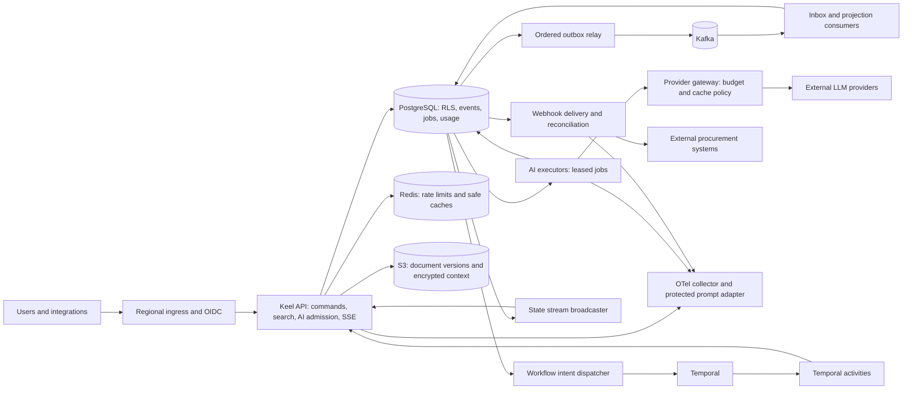
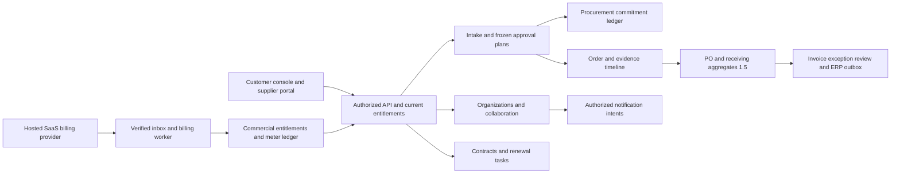

# Architecture

## 1. Placement and boundaries

Keel is a modular backend with independent runtime roles built from one source artifact. Synchronous request handlers perform short transactions and admission decisions. Durable workflows, model generation, event projections and external delivery run outside those transactions. Separating runtime roles allows distinct identity, autoscaling and failure budgets without inventing a service per domain entity.

Workers may call shared domain command libraries with a scoped database transaction instead of an internal HTTP hop. The diagram shows logical ownership, not a requirement for every arrow to cross the network. Command authorization remains enforced for both entry points.

## 2. Runtime roles

| Role | Responsibilities | Scale/identity |
|---|---|---|
| `api` | OIDC/RBAC, order commands, search, inference admission, SSE transport | Baseline three AZ-spread replicas; app API DB role; no owner/DDL privileges |
| `relay` | Publish next events and workflow intents with retry/fencing | Two replicas for failover; leases distribute stream heads; scoped queue metadata privileges |
| `projector` | Kafka inbox, projections, webhook fanout and durable job intake | Consumer-group replica ceiling aligned to partitions; tenant-scoped mutation |
| `ai-executor` | Fair leased-job claims, retrieval/extraction/model work and persisted output | Scales on runnable DB backlog and age; interruptible for resumable work |
| `temporal-worker` | Deterministic onboarding workflows and idempotent activities | Minimum two replicas; activity task-queue concurrency capped |
| `webhook-worker` | Endpoint-safe delivery, attempt recording, reconciliation and replay | Leased delivery claims; per-tenant/endpoint concurrency caps |
| `billing-worker` | Subscription inbox/reconciliation, entitlement and invoice/meter observations | Own SaaS processor identity; bounded queue/provider calls; never procurement payment authority |
| `notification-worker` | Resource-authorized in-app/email/chat intent delivery | Separate mail/chat secrets and quotas; no business approval rights |
| `procurement-worker` (1.5) | Sourcing/PO/receipt/invoice/contract scheduled jobs and qualified ERP handoff | Scoped domain/connector roles; financial transitions remain transactional commands |

State broadcasting is part of API instances: short polling of durable `state_updates` plus Redis notification hints wakes local subscribers. Notifications can be lost; the database sequence cursor is authoritative. API replicas do not hold a complete tenant history in RAM.

## 3. Order command path

Authenticate and derive trusted tenant identity. Acquire admission capacity, begin a tenant-scoped transaction, authorize against current roles/policy, claim an idempotency key, lock the aggregate head, validate expected version/state, append events and update the reconstructable command snapshot, append outbox/state-update rows and store the command response. Commit before returning success. No Kafka, model or webhook call occurs within the transaction.

Each accepted command inserts immutable event/outbox content and a pending `outbox_delivery` row in its transaction. `outbox_publish_heads.next_version` permits one event at a time per aggregate. A relay claim uses `FOR UPDATE SKIP LOCKED`, database-clock expiry and a monotonically increasing lease epoch. The worker validates the allowlisted envelope, publishes synchronously to Kafka outside the transaction, and only after broker acknowledgement marks delivery published and advances the head in one fenced transaction. Broker errors persist a coarse error class and bounded exponential retry with deterministic jitter. A permanently invalid envelope moves to durable `blocked` state, releases its lease and leaves the head in place for operator investigation; later versions cannot pass it. Kafka uses `RequireAll`, one client attempt and tenant/aggregate partition keys; retries belong to PostgreSQL. A lost acknowledgement or worker crash can duplicate an accepted Kafka record, so delivery is at least once and event IDs stay stable across attempts. The K1.5 projector validates the metadata-only envelope against retained canonical outbox history, writes its inbox identity and status-only projection in one tenant transaction, serializes by aggregate head, and repairs gaps from that history. This projection is pinned to one consumer identity until generation-scoped rebuilds exist. Its forced-RLS projector role cannot mutate canonical events. It stores only digests and bounded reasons for malformed/conflicting records; unproven tenant claims use tenantless transport quarantine and raw broker payloads are never persisted. Kafka offset commit/rebalance orchestration and shadow-generation rebuild/cutover are staged separately.

## 4. Search path

Query normalization removes control characters and enforces term/size bounds. The typed retrieval API starts a read-only tenant-scoped transaction. BM25 lexical candidates and pgvector semantic candidates use the same document visibility predicate: tenant, effective ACL/classification, publication status and eligible version. Fetch a bounded candidate pool, combine ranks with RRF, optionally rerank a limited set, and return cited immutable version IDs.

BM25 statistics are tenant-local; global document frequency can leak information and distort small tenants. The initial implementation stores inverted postings and corpus/term statistics in PostgreSQL. This prioritizes isolation and exact scoring over extension dependency. Its capacity envelope is capped and benchmarked. A pg_search/other extension is an optional later adapter, never substituted before qualification of RLS, effective corpus filtering and score behavior.

ANN filtering can underfill results or lose recall. Small/selective tenant corpora use exact search; larger corpora use HNSW with bounded iterative scans and explicit fallback. Qualify actual plans and recall. Do not assume a tenant predicate makes a global ANN index equally efficient for every tenant distribution.

## 5. Model path

Inference admission reserves a bounded worst-case spend in PostgreSQL before queueing. The request references a versioned prompt, provider policy, context/document versions and validated tools. Executors retrieve and redact context, check exact/semantic cache eligibility, and invoke a provider within concurrency/time/budget limits. Streaming chunks are transient; accepted complete responses and final usage are persisted. Provider fallback occurs only before any user-visible content, with a separately charged attempt under the same inference ID.

Sensitive prompts are not blindly sent to the trace backend. A protected context vault can retain encrypted prompt/input/context versions under tenant policy. OTel/Langfuse observations reference that record and store safe metadata. Authorized replay uses a sandbox and suppresses business writes/webhooks.

## 6. Durable approvals

The API commits an onboarding case and a stable workflow-start intent. The dispatcher retries Temporal start using a deterministic workflow ID. Approval commands first write an authorized durable decision and a signal intent. Temporal consumes decision IDs, loads durable records in an activity and deduplicates delivery. It waits on durable timers/signals instead of holding a goroutine or repeatedly polling for three days.

Workflow code contains no direct DB/network calls. Activities are idempotent and identify their logical operation. Workflow version changes preserve already-running cases. Case expiry and approval race handling is specified in SPEC.md.

## 7. Hosted topology and regional model

Production default: one AWS home region, private EKS nodes in three AZs, managed PostgreSQL with synchronous in-region standby, managed Kafka, managed Redis-compatible service, managed/self-hosted qualified Temporal, private S3 access and KMS. Public traffic reaches an ingress/WAF, never the database. Model/webhook outbound traffic uses an egress proxy with hostname/IP policy and bounded connection pools.

Tenants have a home-region field. Edge ingress can run in another region but forwards writes and quota admission to the home region. No multi-region database or Redis conflict resolution is implied. Cross-region disaster recovery uses a promoted recovery region and explicit single-writer fencing; asynchronous replication means nonzero RPO.

Each workload receives distinct Kubernetes/cloud/DB roles. Durable infrastructure is outside the application's scale-to-zero lifecycle. Ghostlight previews run in a separate account and follow the shared dependency contract.

## 8. Optimization strategy

- Keep transactions small: bounded command payloads, no external I/O under row locks, timeouts on locks/statements.
- Use connection pools with a global database connection budget; adding API replicas must not exhaust PostgreSQL.
- Protect model/extraction concurrency with per-tenant fair claims and global worker limits. A single hot tenant must not occupy all provider slots.
- Batch event publication and projection while preserving per-stream correctness; avoid one consumer group per tenant.
- Persist document chunks and versioned embeddings once; maintain lexical/vector projections asynchronously.
- Partition large append-only ledgers by time only after measuring volume; always preserve deduplication semantics across partitions.
- Use bounded SSE fanout, replay cursors and periodic snapshots. Do not retain arbitrary token history in API RAM.
- Scale targeted worker roles before extracting domain services. Split search storage only when its workload envelope exceeds the qualified PostgreSQL adapter.

## 9. Alternatives and consequences

A generic autonomous-agent platform would introduce many unsupported tool effects; Keel keeps one procurement domain and explicit commands. Kafka alone is not an event store with tenant authorization and immutable historical query; PostgreSQL owns that source. Temporal replaces home-grown multi-day timers but adds versioning/operational requirements. Redis accelerates soft admission and cache hints but does not replace durable spend accounting. The first deployment spends on always-on durable services; it does not promise cheap production simply because worker pods can scale to zero.

## 10. SaaS and purchasing module boundaries

Add bounded modules in the existing Go artifact: `organizations/identity`, `commercial`, `notifications/collaboration`, `intake/policies`, `suppliers/portal`, `procurement-budgets`, and in 1.5 `sourcing/catalog`, `purchase-orders/receiving`, `invoice-review`, `contracts/renewals`. Enterprise adds business scopes/risk and policy simulation. Each owns typed commands/tables; cross-module invariants execute within one PostgreSQL transaction through domain libraries. No network hop is needed to convert an approval reservation to commitment.

Money/authority boundaries remain explicit: procurement ledger represents customer spending authority; AI ledger represents provider liability; commercial ledger represents Keel subscription charges. They share transaction infrastructure but not balances or role grants. Customer portal uses supplier-scoped access independent of internal membership. Enterprise business-unit/document scope is enforced below tenant RLS, including search/context/cache eligibility digests.

Billing/notification/provider effects use durable intents/inbox/outbox, scoped identities and reconciliation. Previews simulate those providers. The shared contract 1.1 adds reviewed roles without arbitrary candidate privileges. New runtime roles stay inside admitted DB/CPU/memory/provider budgets; initial technical capacity is requalified with actual SaaS and purchasing workloads. See PRODUCT-SPEC.md and SAAS-FOUNDATION.md for lifecycle/security rules.

## 11. Database tenant context and role boundary (K0.5)

Schema ownership belongs to the non-login `keel_schema_owner`; it is distinct from `keel_context_owner`, which owns the protected agent-role mapping and fixed-search-path `SECURITY DEFINER` tenant resolver. Runtime `keel_app`, `keel_worker` and `keel_agent` capability roles are also non-login, non-owner, non-superuser and `NOBYPASSRLS`. Login principals are provisioned separately and receive only the capability role required for their function. Production credentials and rotation are deployment concerns; the checked-in passwords belong only to the synthetic local profile.

For trusted API/worker commands, middleware must first derive and authorize the tenant from verified identity, parse its canonical UUID, and wrap all tenant-table queries in `tenancy.WithTenantTx`. The wrapper installs a transaction-local custom GUC so pooled connections cannot retain the value after commit or rollback. Because a role with direct access to this shared database can set custom GUCs itself, this is an application correctness boundary, not protection from stolen app/worker credentials. Service identities therefore need narrow workload access and separate operations/rotation.

Agent connections follow a stricter path: a dedicated login is mapped to one tenant in a table inaccessible to runtime capability roles. RLS derives tenant identity from PostgreSQL `session_user` and ignores any supplied GUC for logins that are members of `keel_agent`; an unmapped agent resolves to no tenant. Agents receive SELECT only, cannot inherit app/worker roles, and are called through reviewed typed query tools. Model/provider processes never receive a database URL or credential. The local `tenant_data.rls_probe` plus real-PostgreSQL tests prove this role/context mechanism; they do not prove policies on future tables or the still-open K0 end-to-end API gate. Every tenant-owned table must independently enable and force RLS, apply reviewed policies, and test the complete cross-surface authorization path.

## 12. Schema and release operations (K0.6)

`keel migrate` is a one-shot release operation using a dedicated migration login that can `SET ROLE keel_schema_owner`. It uses one pinned session connection for the PostgreSQL advisory lock and transactional migrations; one lock key serializes migration jobs across replicas. The `keel_meta.schema_migrations` ledger stores monotonically increasing version, immutable filename, exact-file SHA-256 and application time. Drift, missing sources, checksum changes and out-of-order pending files fail closed. Each migration file and ledger insert share one transaction. Applied migrations are immutable; recovery is forward-only. `CREATE INDEX CONCURRENTLY` and other nontransactional DDL are outside this runner and require a reviewed online-migration mechanism.

The management handler separates liveness from caller-supplied dependency readiness probes and exposes build identity and low-cardinality process/request metrics. It does not assert application readiness unless the owning role registers its actual dependencies. Tagged releases compile a reproducible-path Linux/amd64 binary, generate an SPDX SBOM, calculate checksums, publish a GitHub Release and obtain GitHub OIDC-backed provenance plus an SBOM attestation. Attestations bind subjects to a workflow identity; they are not vulnerability scans, policy approval or evidence of production qualification. Expand supported OS/architecture and container signatures only with platform-specific tests and immutable build inputs.

## 13. Order domain kernel and transactional persistence (K1.1–K1.4)

`internal/orders` owns a pure order command/state transition model and deterministic event reducer. Commands receive event identity and time explicitly and do not read the clock, database, network, or identity provider; an authorized application service supplies trusted metadata. The kernel validates aggregate identity, expected version, contiguous event versions, evidence-digest binding, terminal-state rules and requester/approver separation. Supplier eligibility, supported-currency catalog membership, threshold evaluation and role authorization remain application-service responsibilities. `Replay` rebuilds the command snapshot from a complete event stream, and `VerifySnapshot` compares it to a stored snapshot.

`internal/orders/postgres` is the K1.2 persistence boundary. Create claims a tenant/route/key-digest registry row, enforces a tenant-unique bytewise/case-sensitive external reference, stores the version-1 head and event, then records response detail and completes the key in one transaction. Submit locks the aggregate head, checks the expected version and atomically updates the snapshot, appends the event and stores the response. Concurrent use of the same key waits on the unique registry key and replays the committed outcome; a different request hash or principal binding conflicts. Response bodies live in the RLS-protected seven-day detail table. The compact digest registry stores no raw key, principal reference or request body; its operation reference resolves successful expired retries to current state, and it survives detail pruning. Rejected business outcomes are replayable while detail remains and return the stable expired-record error after it is pruned. No successful business command can commit with an `in_progress` registry row.

Order heads, events, idempotency rows, outbox envelopes and state-feed rows use forced tenant RLS and least-privilege grants. Accepted create/submit transactions append the immutable event, a schema-versioned allowlisted outbox envelope, a per-tenant ordered state-feed row, and the idempotency result alongside the snapshot update. A tenant feed counter is updated in the same transaction; this creates a per-tenant serialization point so a later committed cursor cannot become visible before an earlier cursor. A bounded worker can delete only feed rows older than 24 hours under a separate age-specific RLS policy; it cannot reset the counter or delete fresh feed entries. The tradeoff is write contention inside very large tenants, which should be measured before considering a different cursor protocol.

The outbox envelope and state-feed payload contain only event/aggregate IDs, aggregate version, safe event type/status and schema version. They omit descriptions, external references, supplier IDs, amounts and evidence. Event reads verify per-event digests, indexed metadata, contiguous replay and equality with the current snapshot under a repeatable-read tenant transaction. The underlying created event remains protected order data. App roles cannot update or delete event/outbox/feed rows; the worker can only delete state-feed rows that have passed the 24-hour RLS retention boundary. K1.4 stores mutable retry/claim metadata in separate forced-RLS tables, and its publisher acknowledges only a live owner/epoch/version claim. Stable event IDs make consumer deduplication possible; they do not make broker delivery exactly once. This still does not implement the HTTP surface or close the K0 end-to-end authorization/isolation gate.
